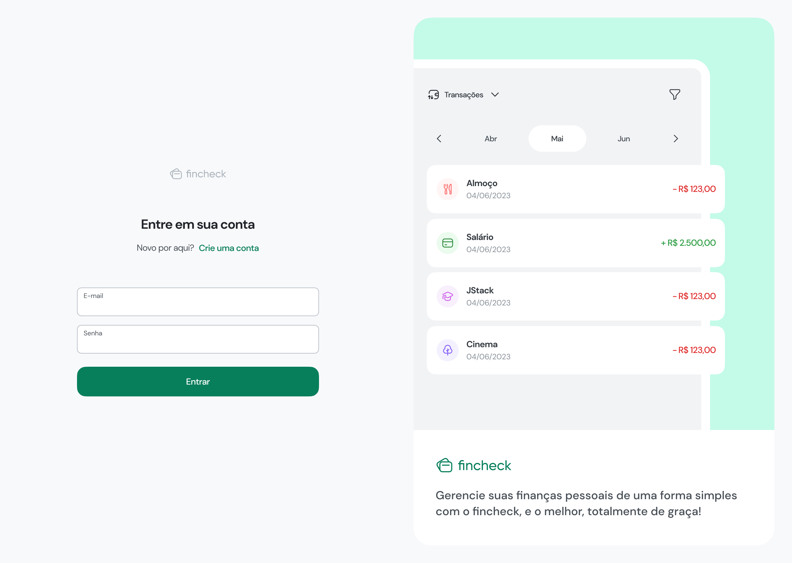
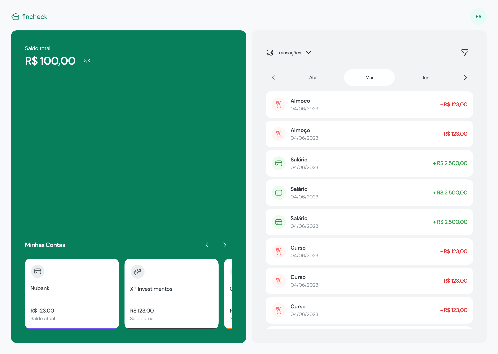
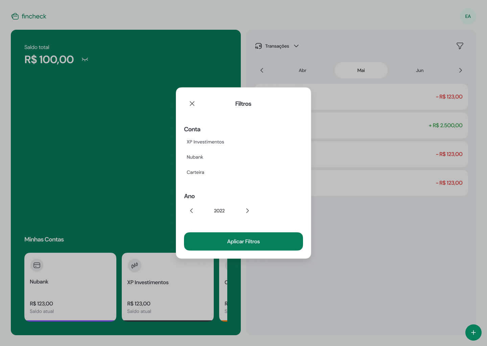

# FINCHECK - Control your finances

> FINCHECK is an application for managing personal finances. Monitor your expenses in a simple way, being able to filter by account, category and date.

 => The Project is under development

## 👩‍💻 Technologies used
  
  ### Back-end
    * NestJS
    * Typescript
    * PostgreSQL
    * Prisma
    * Docker
    * JWT

  ### Front-end Web

    * React / Vite 
    * Typescript
    * TailwindCSS
    * Zod
    * React Query
    
## Preview

### Login Page

### Home Page

## Home Filter page

